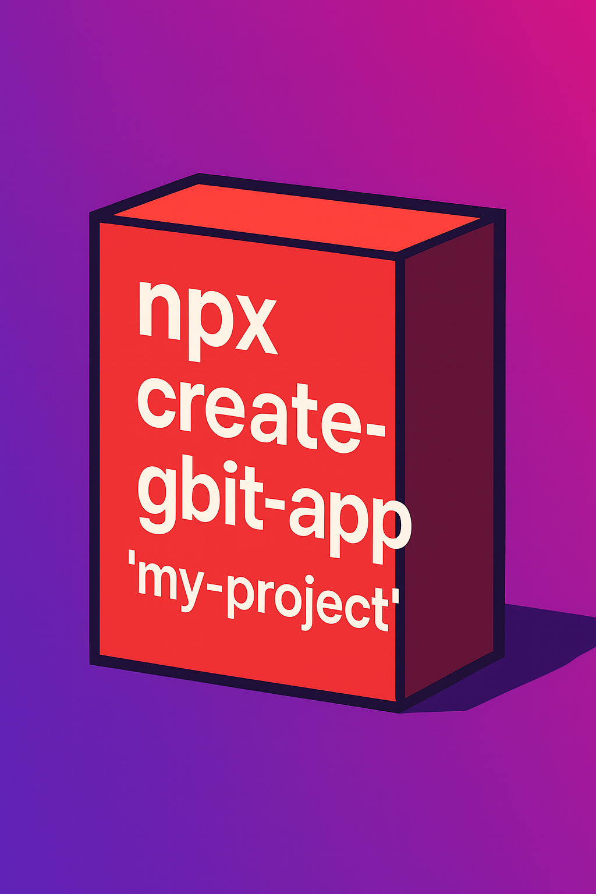

<div align="center">
  
</div>
 <div align="center">


## GBit — The All-in-One Modern Project GeneratoR
  
GBit is a powerful open-source tool designed for modern developers. With a single command, it creates a complete project structure — including backend, frontend, and smart contracts — ready to build and deploy.

Use the command:

```bash
 npx create-gbit-app@latest "meu-projeto"
```
                          
GBit also comes with an optimized build tool:

```bash
 npx gbit-build
```
💡 Open Source | Fast | Modern | Developer-Gbit


<div align="center">


<h1>Gbit Framework</h1> <p>Crie aplicações completas — Frontend, Backend e Smart Contracts — prontas para produção.</p>

<a href="#instalação" style="text-decoration:none;">  </a> <a href="#demo" style="text-decoration:none;">  </a> <a href="https://portfolio.metamask.io" target="_blank" style="text-decoration:none;">  </a>

</div>


# Gbit  Framework  

[](https://www.npmjs.com/package/create-gbit-app)


  ##  GBit — The All-in-One Modern Project Generator
  
GBit is a powerful open-source tool designed for modern developers. With a single command, it creates a complete project structure — including backend, frontend, and smart contracts — ready to build and deploy.

Use the command:

```bash
 npx create-gbit-app@latest "meu-projeto"
```
                          
GBit also comes with an optimized build tool:

```bash
 npx gbit-build
```
💡 Open Source | Fast | Modern | Developer-Gbit

### Crie aplicações completas — Backend, Frontend e Smart Contracts

[](https://www.npmjs.com/package/create-gbit-app)
[](https://github.com/Gislaine-programadora/create-gbit-app/blob/main/LICENSE)

</div>

## 🚀 Início Rápido

```bash
npx create-gbit-app@Latest meu-projeto
```

### Visual terminal: 


## ✨ Features

- ✓ **Backend Completo** - Node.js ou Python com Express, Nest.js ou Flask
- ✓ **Frontend Moderno** - React, Next.js ou Vite com TypeScript e Tailwind CSS
- ✓ **Smart Contracts** - Solidity ou Vyper com scripts de deploy automáticos
- ✓ **Docker Ready** - Docker e Docker Compose configurados automaticamente

## 🎯 O que é o Gbit Framework?

O Gbit Framework é uma ferramenta CLI que permite criar aplicações full stack completas em minutos, incluindo:
##  https://gislaine-programadora.github.io/Framework-gbit/

## https://github.com/Gislaine-programadora/flamework-gbit/blob/main/LICENSE

- **Backend Poderoso**: Node.js ou Python com Express, Nest.js ou Flask. WebSockets, APIs REST e muito mais.
- **Frontend Moderno**: React, Next.js ou Vite com TypeScript. Tailwind CSS e componentes prontos.
- **Blockchain Ready**: Smart contracts em Solidity ou Vyper. Scripts de deploy e ABI automáticos.
- **Pronto para Produção**: Docker, Docker Compose, CI/CD com Vercel. Tudo configurado automaticamente.

## 📦 Instalação

🔗 Link oficial do pacote   https://www.npmjs.com/package/create-gbit-app


### Uso Direto (Recomendado)

```bash
npx create-gbit-app@Latest meu-projeto
```

### Instalação Global

```bash
npm install -g create-gbit-app
create-gbit-app meu-projeto
```

## 🛠️ Tecnologias Suportadas

### Backend
- Node.js (Express, Nest.js)
- Python (Flask)
- WebSockets (Socket.io)

### Frontend
- React + Vite
- Next.js
- TypeScript/JavaScript
- Tailwind CSS

### Smart Contracts
- Solidity
- Vyper
- Hardhat
- Deploy Scripts Automáticos

### Banco de Dados
- PostgreSQL
- MySQL
- MongoDB
- SQLite

### DevOps
- Docker & Docker Compose
- CI/CD Vercel
- Git Configuration

  ## Ferramenta de compilacao use "gbit-build" typeScript/vite:
  
  🧱 gbit-build: ferramenta de build completa


  ```bash
  npx gbit-build

  

O pacote  é responsável por empacotar e preparar seu projeto com comandos simples e poderosos:


<div align="center">
  
</div>


📦 Instalação

```bash
npm install --save-dev gbit-build

...

⚙️ Comandos disponíveis

```bash

npx gbit-build               # Build completo
npx gbit-build --only-frontend
npx gbit-build --skip-docker
npx gbit-build --verbose
npx gbit-build --dry-run
...

O  automatiza o build do frontend, backend e geração de imagem Docker.


## 📖 Documentação

Para mais informações, visite a [documentação completa](https://github.com/gislaine-programadora/create-gbit-app).

 


## 🤝 Contribuindo

Contribuições são bem-vindas! Sinta-se à vontade para abrir issues e pull requests.

#npm

## 📄 Licença

[](https://www.npmjs.com/package/create-gbit-app)

MIT

---

<div align="center">

**Criado com ❤️ usando Gbit Framework**

[Website](https://gbitframework.com) • [Documentação](https://docs.gbitframework.com) • [GitHub](https://github.com/gislaine-programadora/create-gbit-app)

</div>
